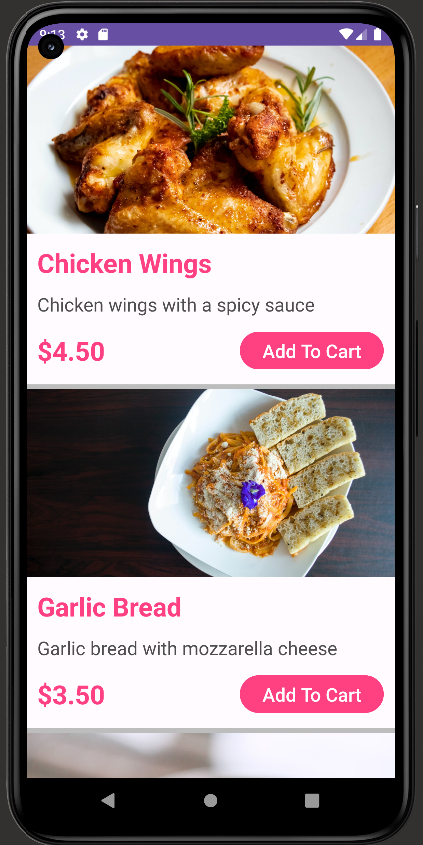

# DevFeed Restaurant App

## Introduction

This is the second app I have developed. 
It is a simple restaurant app that was mainly built to learn how to use different layouts, view navigation, working with lists and intents.

## What  I learnt

In this project, I learnt a lot about the following:

- Using **Relative layouts** to create a complex layout
- Working with **Dependencies** such as the `androidx.cardview:cardview:1.0.0`
- Using the **ListView** and **ArrayAdapter** to display a list of items
- Working with **Intents** to navigate from one activity to another
- Declaring activities in the **AndroidManifest.xml** file
- using **view binding** to bind views to the activity which avoids the use of `findViewById()`

## Technologies Used

- **Kotlin:** The app is completely written in Kotlin.
- **XML layouts** Used to create the user interface and handle user interaction.

## Screenshots (might be outdated)

